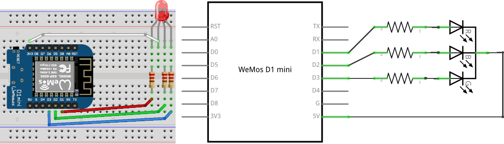

# The Internet

As seen in the IT Crowd episode "The speech", this is the Intenet.

[Transcript](https://www.imdb.com/title/tt1320786/quotes/?item=qt1123381)

## Implementation

This is implemented using an esp8266, it connects to the Wifi as configured in `settings.h` , then it will ping to the destination. Red means the ping worked, purple is used to indicate failure. If latency is higher, the hue will shift from red to purple.

## Schematic

